# Flutter

## Introducción

Flutter es un SDK que permite desarrollar aplicaciones híbridas, es decir,
que pueden ejecutarse tanto en la Web, como en PC, móvil…

## Instalación

Los pasos a seguir están documentados en [Flutter Docs](https://docs.flutter.dev/install/quick).

### Linux (Debian, Ubuntu)

Primero hay que instalar los paquetes necesarios, para ello hay que ejecutar los
siguientes comandos en la terminal:

```bash
sudo apt-get update -y && sudo apt-get upgrade -y
sudo apt-get install -y curl git unzip xz-utils zip libglu1-mesa
```


Cuando termine, abrimos el **V**isual **S**tudio **C**ode (es el que recomienda)
e instalamos la extensión de Flutter.

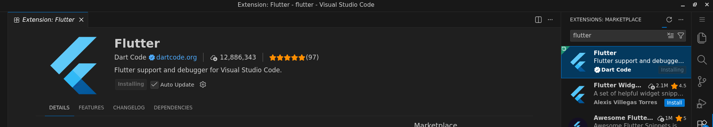

Una vez instalado, pulsamos <kbd>Ctrl</kbd>+<kbd>Shift</kbd>+<kbd>P</kbd>
para abrir la paleta de comandos de VSC, escribimos **`flutter`** y
seleccionamos **`New project`**.

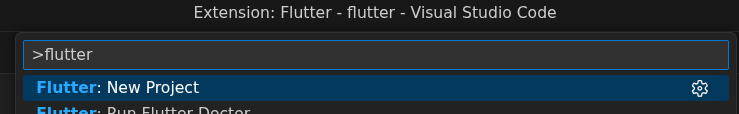

En la esquina inferior derecha puede que salga un error porque no tenemos el
SDK instalado, lo instalamos.

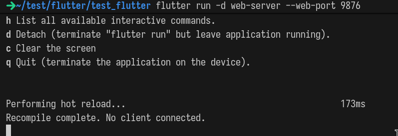

Cuando termine reiniciamos VSC y al crear un nuevo proyecto, esta vez saldrán
diferentes templates. Partiremos de **`Application`**.

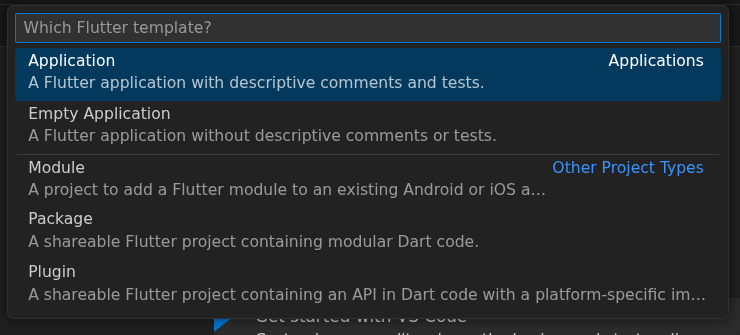

Y nos creará la siguiente estructura:

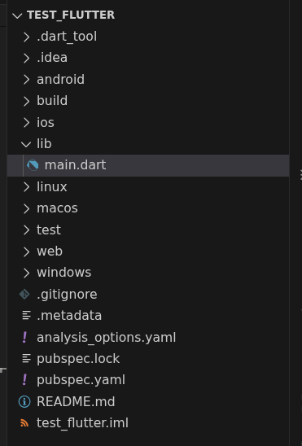

## Desarrollo

Donde se trabajará será en el directorio **`lib`**, por defecto trae un
**`main.dart`**, que sin los comentarios contiene lo siguiente:

```dart
import 'package:flutter/material.dart';

void main() {
 runApp(const MyApp());
}

class MyApp extends StatelessWidget {
 const MyApp({super.key});

 @override
 Widget build(BuildContext context) {
   return MaterialApp(
     title: 'Flutter Demo',
     theme: ThemeData(colorScheme: .fromSeed(seedColor: Colors.deepPurple)),
     home: const MyHomePage(title: 'Flutter Demo Home Page'),
   );
 }
}

class MyHomePage extends StatefulWidget {
 const MyHomePage({super.key, required this.title});
 final String title;

 @override
 State<MyHomePage> createState() => _MyHomePageState();
}

class _MyHomePageState extends State<MyHomePage> {
 int _counter = 0;

 void _incrementCounter() {
   setState(() {
     _counter++;
   });
 }

 @override
 Widget build(BuildContext context) {
   return Scaffold(
     appBar: AppBar(
       backgroundColor: Theme.of(context).colorScheme.inversePrimary,
       title: Text(widget.title),
     ),
     body: Center(
       child: Column(
         mainAxisAlignment: .center,
         children: [
           const Text('You have pushed the button this many times:'),
           Text(
             '$_counter',
             style: Theme.of(context).textTheme.headlineMedium,
           ),
         ],
       ),
     ),
     floatingActionButton: FloatingActionButton(
       onPressed: _incrementCounter,
       tooltip: 'Increment',
       child: const Icon(Icons.add),
     ),
   );
 }
}
```

Si ejecutamos en la terminal `flutter run -d web-server --web-port 9876`,
abrirá un servidor en el puerto 9876.

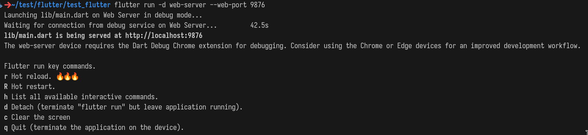

Si accedemos, veremos lo siguiente

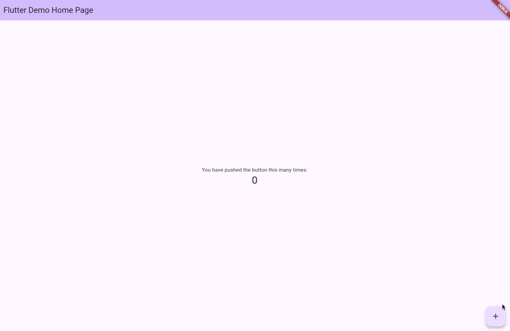

Al darle al botón *+* en la esquina inferior derecha, se aumentará el contador


Si queremos que se reduzca, podemos o bien crear un botón nuevo y la función
respectiva para reducir el contador, o la vía fácil, en lugar de que
incrementar aumente el contador, que lo reduzca.

```dart
 void _incrementCounter() {
   setState(() {
     _counter--;
   });
 }
```

En la terminal, pulsamos la tecla **r** para hacer un *hot-reload*, básicamente
que se apliquen los cambios hechos sin tener que reiniciar el servidor

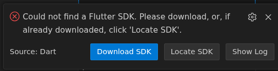

Y ahora el botón reducirá el contador

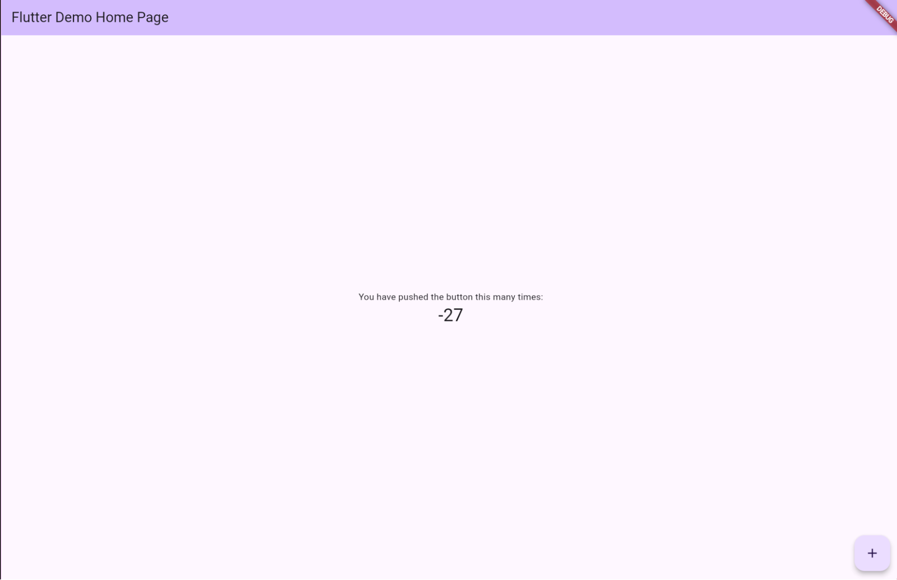

Pero es un poco contraintuitivo que un botón que pone *+* reduzca el contador,
así que también usaremos la otra vía, crear un nuevo botón, para ello, creamos
la función para que se reduzca el contador

```dart
 void _decrementCounter() {
   setState(() {
     _counter--;
   });
 }
```

Y modificamos el *floationActionButton* para que pueda tener más de un botón,
en este caso el de *decrement* y el de *increment*

```dart
     floatingActionButton: Row(
       mainAxisAlignment: .center,
       children: [
         FloatingActionButton(
           onPressed: _decrementCounter,
           tooltip: 'Decrement',
           child: const Icon(Icons.remove),
         ),
         FloatingActionButton(
           onPressed: _incrementCounter,
           tooltip: 'Increment',
           child: const Icon(Icons.add),
         ),
       ],
```

Si hacemos un hot-reload, pulsando la **r** en la terminal, veremos que en la
página están los nuevos botones

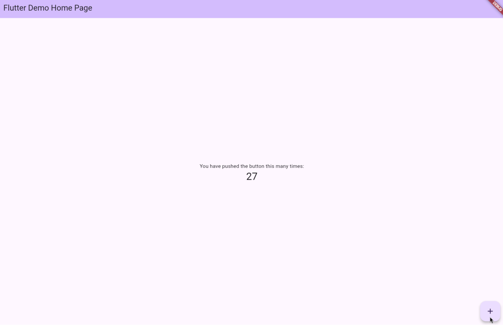

El código final sería el siguiente:

```dart
import 'package:flutter/material.dart';

void main() {
 runApp(const MyApp());
}

class MyApp extends StatelessWidget {
 const MyApp({super.key});

 @override
 Widget build(BuildContext context) {
   return MaterialApp(
     title: 'Flutter Demo',
     theme: ThemeData(colorScheme: .fromSeed(seedColor: Colors.deepPurple)),
     home: const MyHomePage(title: 'Flutter Demo Home Page'),
   );
 }
}

class MyHomePage extends StatefulWidget {
 const MyHomePage({super.key, required this.title});
 final String title;

 @override
 State<MyHomePage> createState() => _MyHomePageState();
}

class _MyHomePageState extends State<MyHomePage> {
 int _counter = 0;

 void _incrementCounter() {
   setState(() {
     _counter++;
   });
 }

 void _decrementCounter() {
   setState(() {
     _counter--;
   });
 }

 @override
 Widget build(BuildContext context) {
   return Scaffold(
     appBar: AppBar(
       backgroundColor: Theme.of(context).colorScheme.inversePrimary,
       title: Text(widget.title),
     ),
     body: Center(
       child: Column(
         mainAxisAlignment: .center,
         children: [
           const Text('You have pushed the button this many times:'),
           Text(
             '$_counter',
             style: Theme.of(context).textTheme.headlineMedium,
           ),
         ],
       ),
     ),
     floatingActionButton: Row(
       mainAxisAlignment: .center,
       children: [
         FloatingActionButton(
           onPressed: _decrementCounter,
           tooltip: 'Decrement',
           child: const Icon(Icons.remove),
         ),
         FloatingActionButton(
           onPressed: _incrementCounter,
           tooltip: 'Increment',
           child: const Icon(Icons.add),
         ),
       ],
     ),
   );
 }
}
```

> [!NOTE]
> 
> Si se quiere ejecutar directamente en una aplicación de Linux, hay que
> instalar los siguientes paquetes con
>
> ```shell
> sudo apt install -y ninja-build libgtk-3-dev mesa-utils
> ```

## Build

### Android

Para buildear en Android, tenemos que ejecutar el comando **flutter build apk**,
pero seguramente salga este error porque no tenemos el SDK de Android.

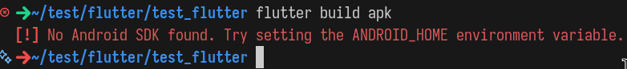

Para solucionarlo lo descargamos. La forma fácil es descargando **Android Studio**,
que incluye todo lo necesario. Pero lo haremos con comandos pues ocupa menos
espacio, para ello descargamos el SDK del siguiente
[enlace](https://developer.android.com/studio#command-line-tools-only)

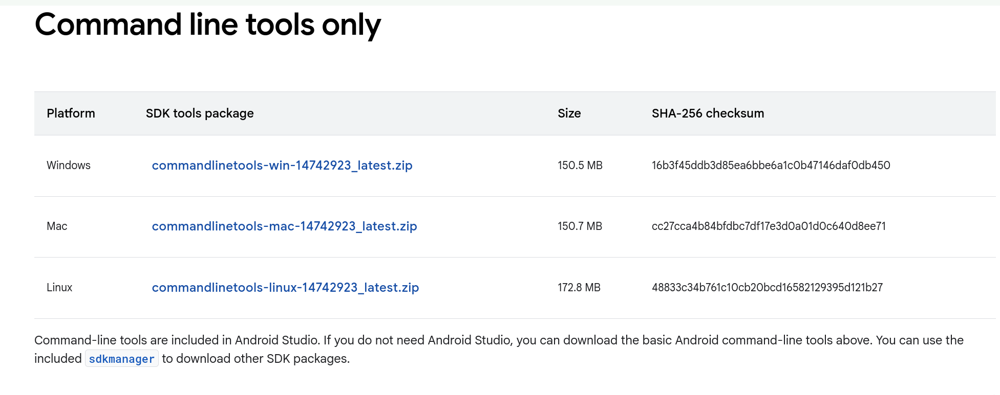

También necesitaremos las platform-tools, que obtendremos del siguiente
[enlace](https://developer.android.com/tools/releases/platform-tools?hl=en#downloads) 
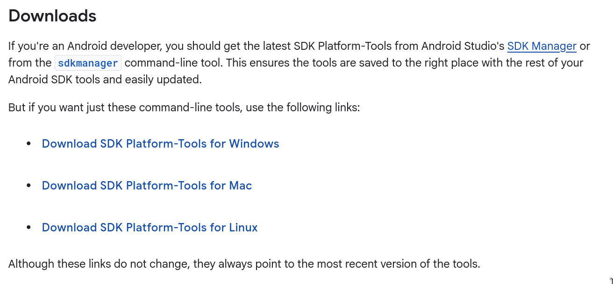

Una vez descargados, los descomprimimos, en este caso con:

```bash
unzip commandlinetools-linux-14742923_latest.zip
unzip platform-tools-latest-linux.zip
```

Y creamos una variable de entorno `ANDROID_SDK` que contenga el directorio actual con

```bash
echo ANDROID_HOME=$PWD | tee -a $HOME/.bashrc # (suponiendo que se utilice bash)
```

> [!IMPORTANT]
>
> Especificar la flag **`-a`** al comando **tee** o *sobreescribirá* el archivo **.bashrc**
>
> **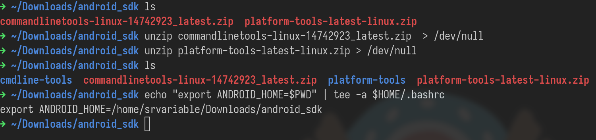**

Luego ejecutaremos el comando:

```bash
./cmdline-tools/bin/sdkmanager --sdk_root=. "platforms;android-36" "build-tools;28.0.3"
```

Pedirá aceptar una licencia, escribimos **y**

****

Y en VSC hacemos

```bash
flutter config –android-sdk $HOME/Downloads/android_sdk
```

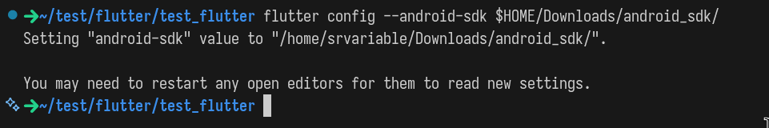

Luego ejecutamos **flutter doctor --android-licenses** y si da el siguiente error


Movemos el contenido de *cmdline-tools* a una carpeta *latest*

```
cd cmdline-tools
mkdir latest
mv * latest
```

**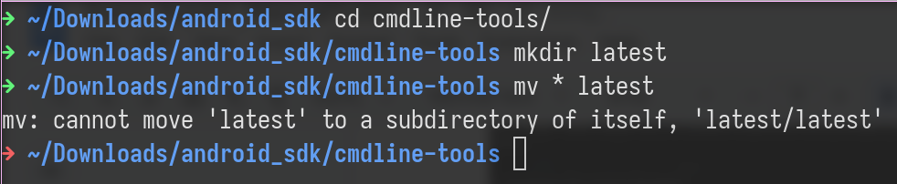**

Y volvemos a probar, deberían salir muchas licencias a aceptar, escribimos **y** en cada petición


Ahora haremos **flutter build apk** y si da el siguiente error

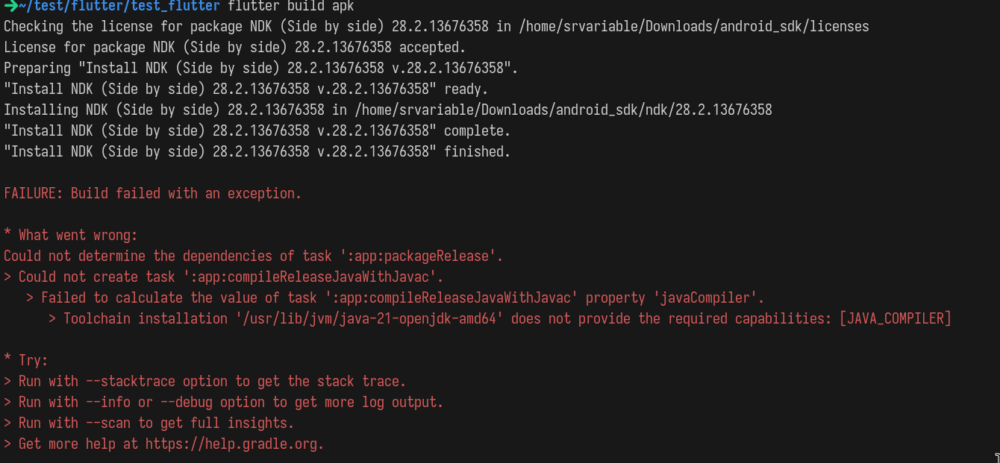

Instalamos el paquete necesario

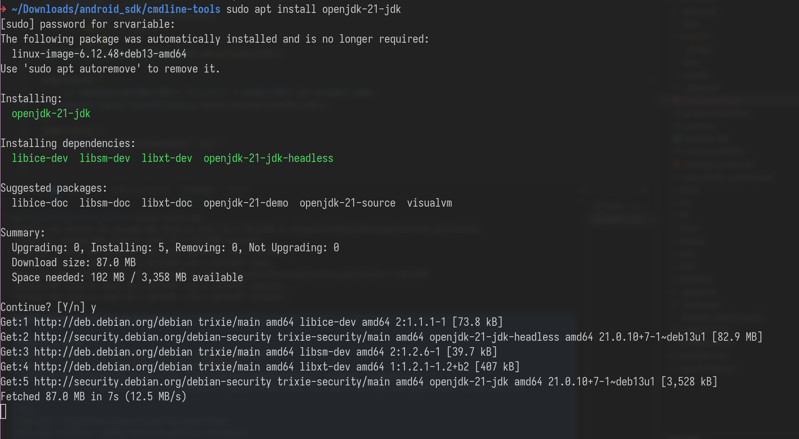

Y volvemos a ejecutar el comando

```bash
flutter build apk
```

Y generará el `.apk` que se tendrá que instalar en el móvil.

### Linux

En Linux no hay tantos pasos, simplemente hay que instalar los siguientes paquetes:

```bash
sudo apt-get update -y && sudo apt-get upgrade -y
sudo apt-get install -y clang cmake ninja-build pkg-config libgtk-3-dev libstdc++-12-dev
```

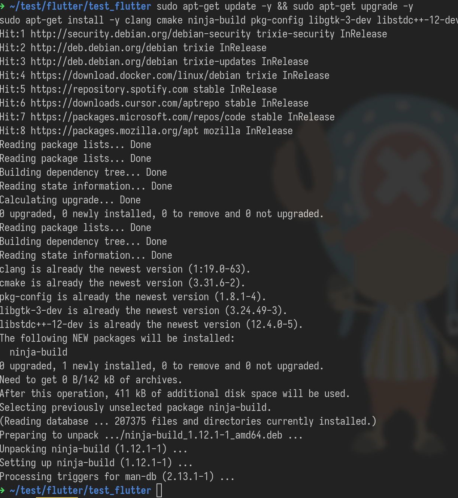

Y ejecutar:

```bash
flutter build linux
```


